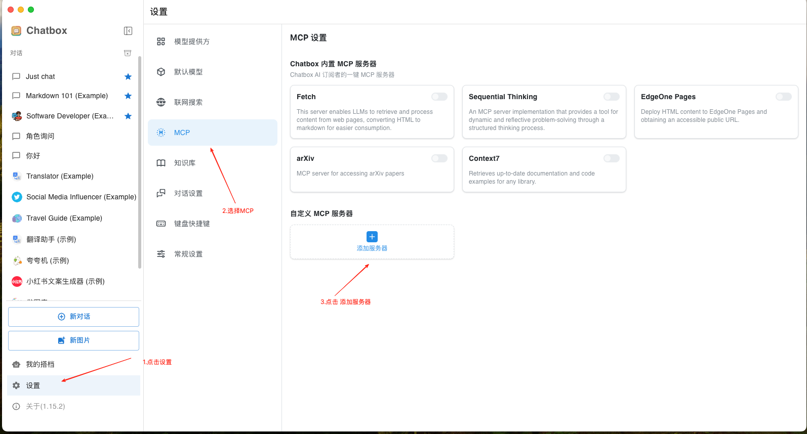
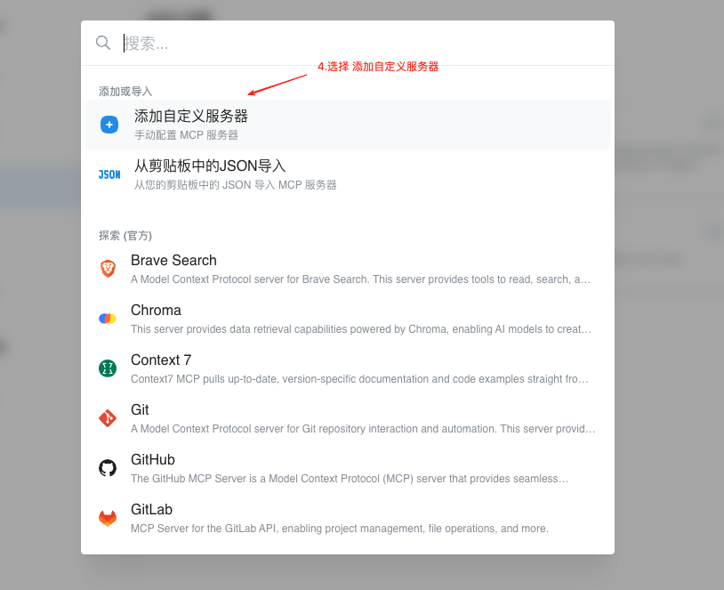
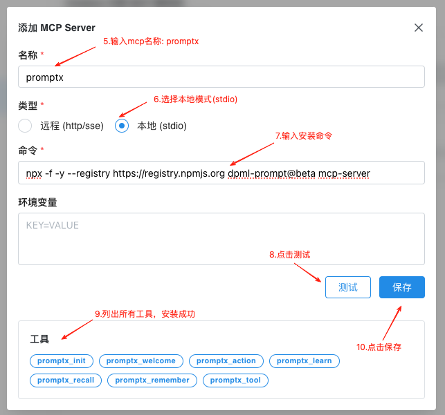
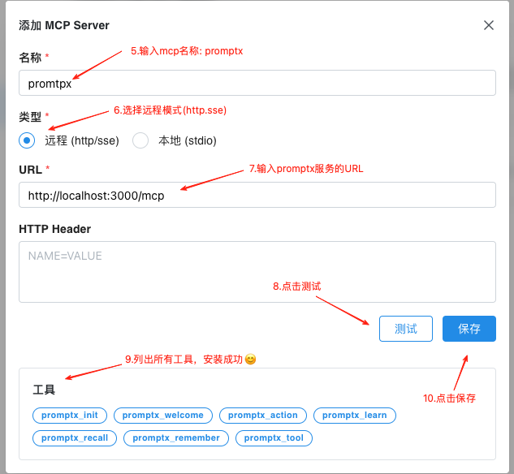
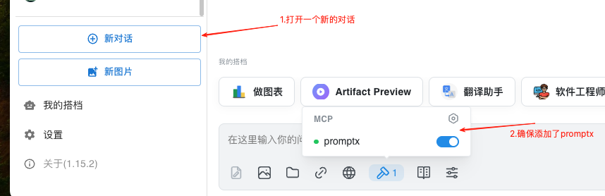
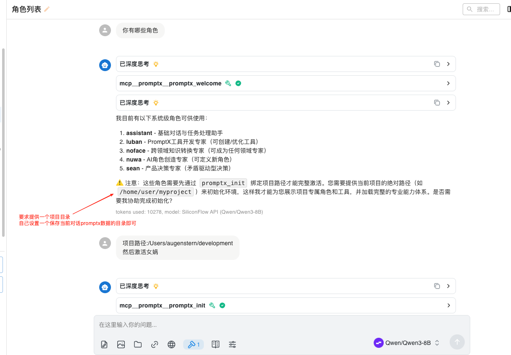

# Trae国际版

本文档用于介绍如何在 ChatBox 中安装Promptx MCP

## 安装命令

### 本地模式(推荐)

```shell
npx -f -y --registry https://registry.npmjs.org dpml-prompt@beta mcp-server
```

### Http模式

`http://localhost:3000/mcp`

## 流程图

### 1. 打开MCP页面





### 2. 复制安装命令，进行粘贴

#### 2.1 本地模式(推荐)


#### 2.2 Http模式


## 使用
**示例中的项目目录是Mac系统，注意区分Windows和Mac的区别**

