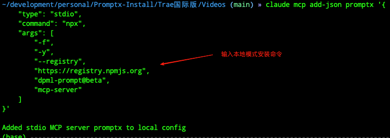
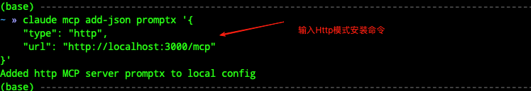
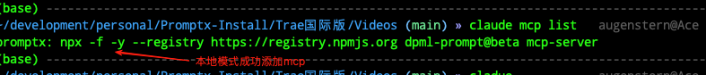
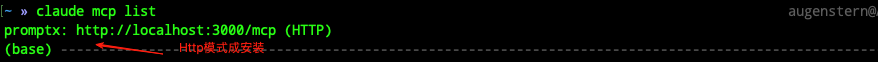

# Claude Code

本文档用于介绍如何在Claude Code中安装Promptx MCP

## Windows

### 本地模式(推荐)

#### 安装命令

```shell
# 设置镜像源
npm config set registry https://registry.npmjs.org

# 查看镜像源是否设置成功
npm config get registry

# 全局安装promptx
npm install -g dpml-prompt@beta

# 添加promptx mcp服务
claude mcp add promptx cmd /c dpml-prompt mcp-server
```

#### 图文流程

### Http模式

#### 安装命令
```bash
claude mcp add --transport http promptx http://localhost:3000/mcp
```

#### 图文流程


## Mac

### 本地模式(推荐)
#### 安装命令
```shell
claude mcp add-json promptx '{
    "type": "stdio",
    "command": "npx",
    "args": [
        "-f",
        "-y",
        "--registry",
        "https://registry.npmjs.org",
        "dpml-prompt@beta",
        "mcp-server"
    ]
}'
```
#### 图文流程


### Http模式
#### 安装命令
```shell
claude mcp add-json promptx '{
    "type": "http",
    "url": "http://localhost:3000/mcp"
}'
```
#### 图文流程


## 查看安装结果
查看mcp命令
```shell
claude mcp list
```



查看mcp是否可用，命令
```shell
claude
```


# 本地模式

# Http模式
