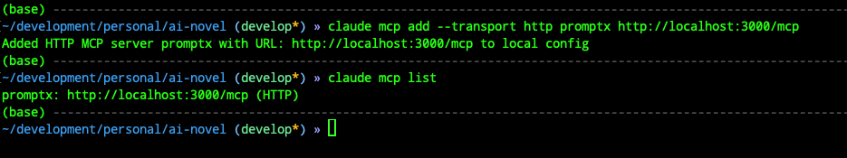
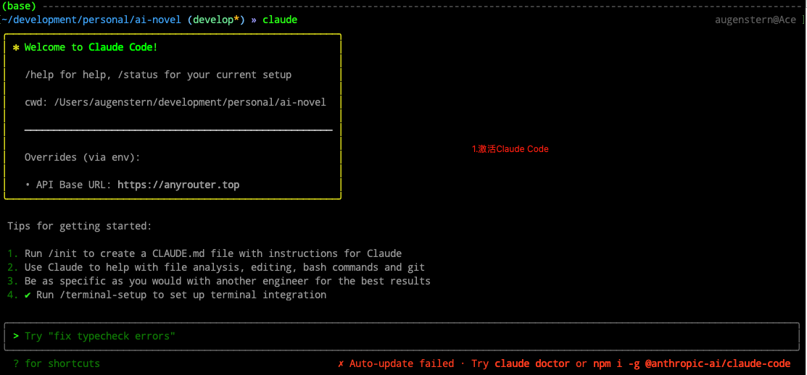

# Claude Code

本文档用于介绍如何在Claude Code中安装Promptx MCP

## 安装命令

### 本地模式(推荐)

```json
claude mcp add-json promptx '{
    "type": "stdio",
    "command": "npx",
    "args": [
        "-f",
        "-y",
        "--registry",
        "https://registry.npmjs.org",
        "dpml-prompt@beta",
        "mcp-server"
    ]
}'
```

### Http模式

```bash
claude mcp add --transport http promptx http://localhost:3000/mcp
```

## 流程图

### 1. 安装MCP

#### 1.1 Windows

##### 1.1.1 本地模式(推荐)

❗️暂不支持

##### 1.1.2 Http模式


#### 1.2. Mac

##### 1.2.1 本地模式(推荐)


##### 2.1.2 Http模式



### 2 检查MCP是否可用

#### 2.2.1 本地模式




#### 2.2.2 Http模式


