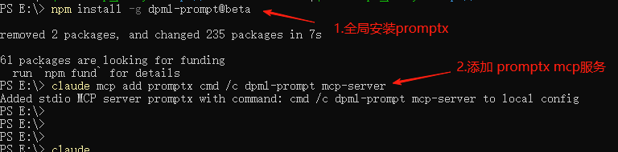
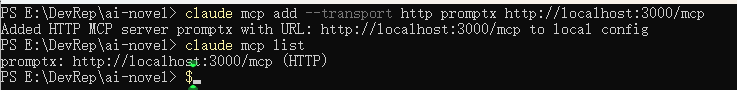
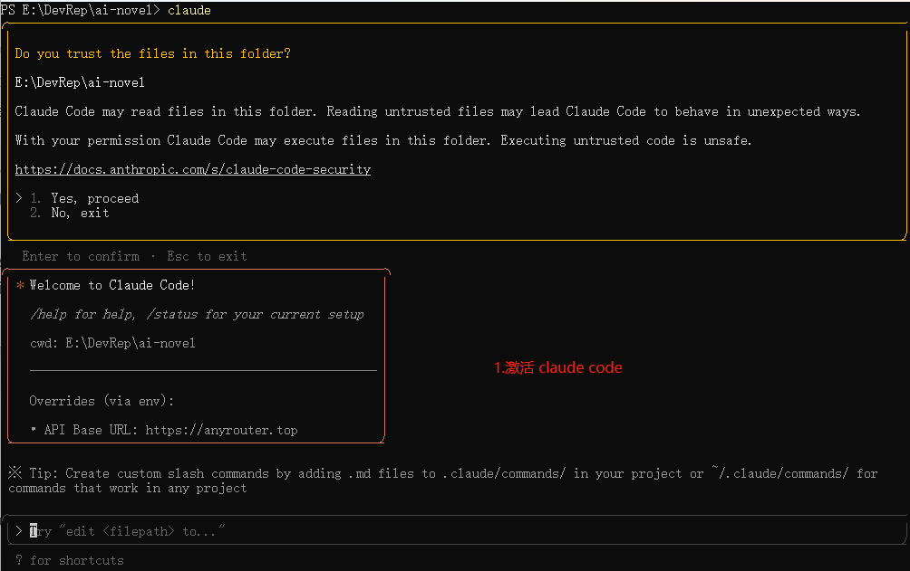
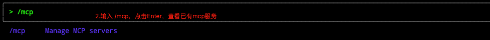
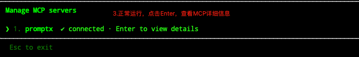
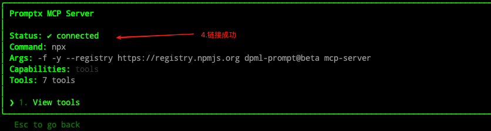
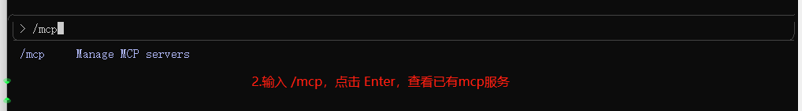
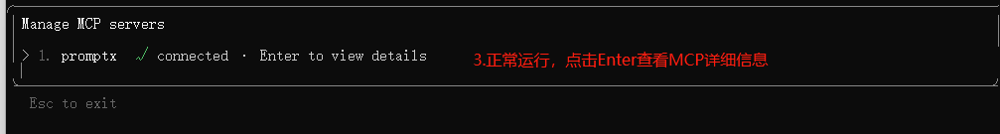
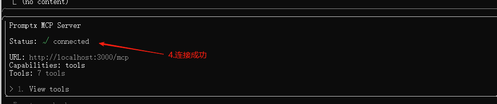

# Claude Code

本文档用于介绍如何在Claude Code中安装Promptx MCP

## 安装命令

### 本地模式(推荐)

```shell
# 设置镜像源
npm config set registry https://registry.npmjs.org

# 查看镜像源是否设置成功
npm config get registry

# 全局安装promptx
npm install -g dpml-prompt@beta

# 添加promptx mcp服务
claude mcp add promptx cmd /c dpml-prompt mcp-server
```

### Http模式

```bash
claude mcp add --transport http promptx http://localhost:3000/mcp
```

## 流程图

### 1. 安装MCP

#### 1.1 Windows

##### 1.1 本地模式(推荐)


##### 1.1.2 Http模式



#### 1.2. Mac









#### 2.2.2 Http模式









