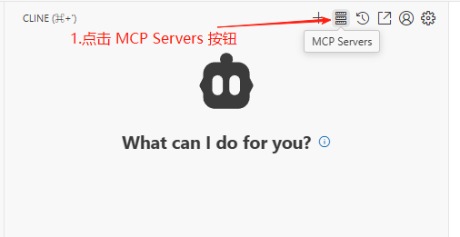
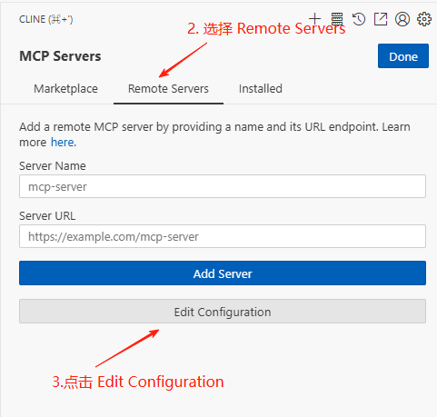
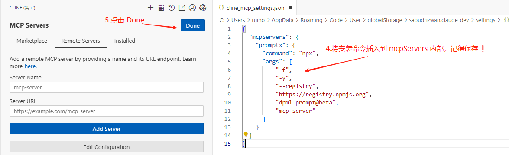
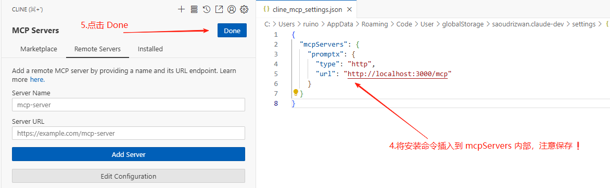
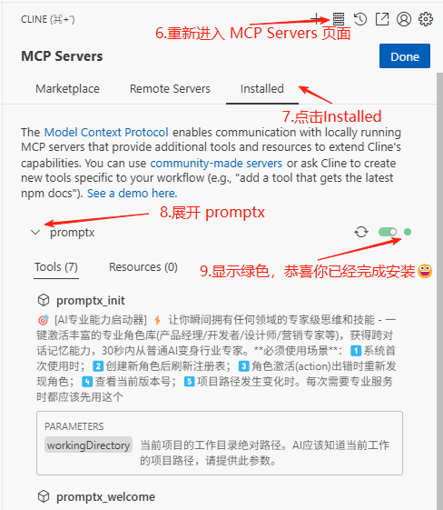

# Cline

本文档用于介绍如何在Cline中安装Promptx MCP

本文档的Cline使用的是VSCode插件

## 安装命令

### 本地模式(推荐)

```json
"promptx": {
    "command": "npx",
    "args": [
        "-f",
        "-y",
        "--registry",
        "https://registry.npmjs.org",
        "dpml-prompt@beta",
        "mcp-server"
    ]
}
```

### Http模式

```json
"promptx": {
  "type": "http",
  "url": "http://localhost:3000/mcp"
}
```

## 流程图

### 1. 打开Cline MCP页面





### 2. 复制安装命令，进行粘贴

#### 2.1 本地模式(推荐)


#### 2.2 Http模式


### 3. 完成安装




