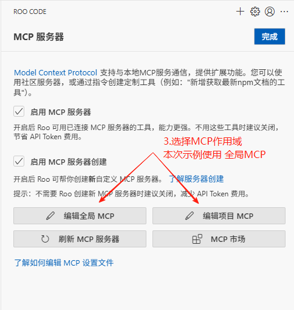

# Roo Code

本文档用于介绍如何在Roo Code中安装Promptx MCP

## 安装命令

### 本地模式(推荐)

```json
"promptx": {
    "command": "npx",
    "args": [
        "-f",
        "-y",
        "--registry",
        "https://registry.npmjs.org",
        "dpml-prompt@beta",
        "mcp-server"
    ]
}
```

## 流程图

### 1. 打开 MCP 页面




### 2. 复制安装命令，进行粘贴


### 3. 完成安装


