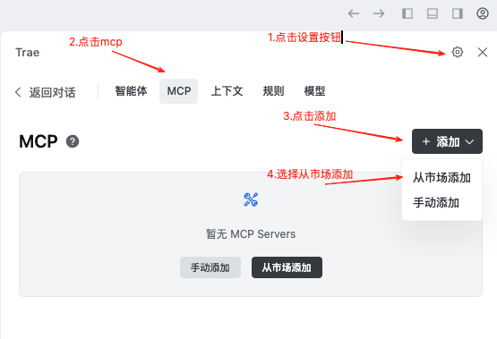
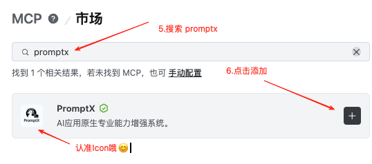
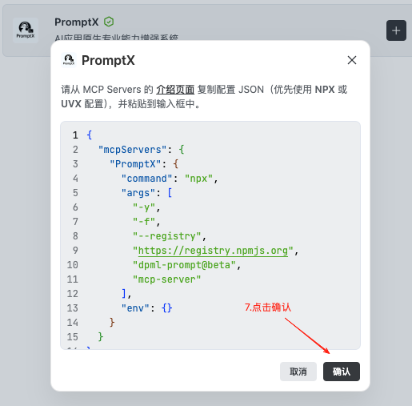
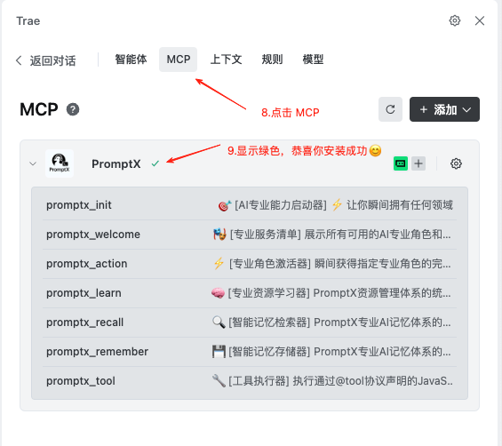
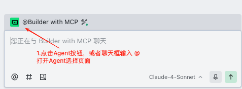
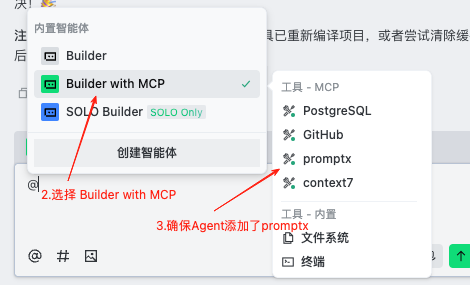

# Trae国内版

本文档用于介绍如何在Trae 国内版中安装Promptx MCP
国内版已上架MCP市场，可以通过MCP市场一键安装

## 视频教程
<video src="https://github.com/user-attachments/assets/a08b1674-068b-42db-b6cc-19d0f85b780b"
       width="640" height="360" controls>
</video>

## 图文教程
1. 打开MCP市场

2. 搜索`promptx`

3. 点击安装 

## 完成安装

## 使用

