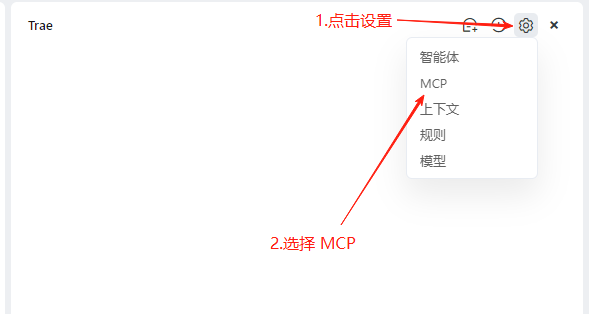
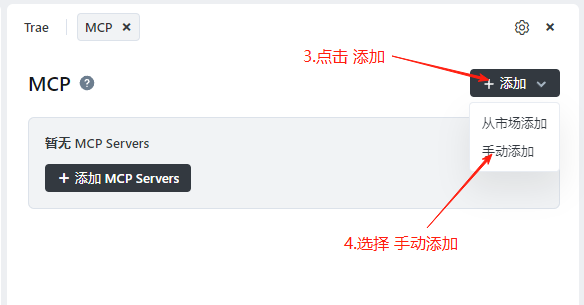
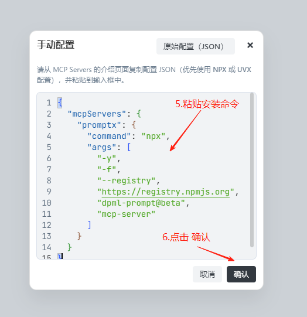
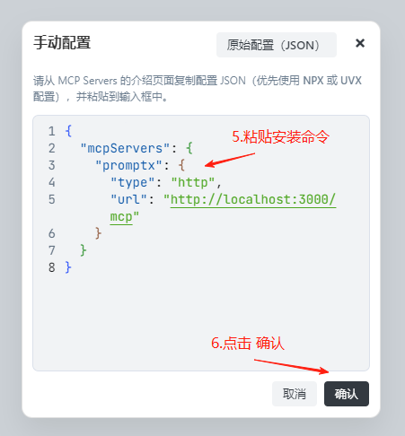
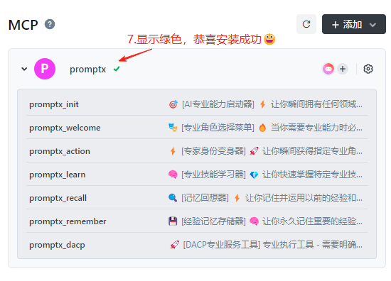
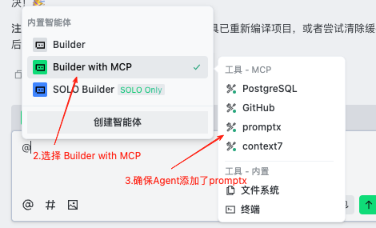

# Trae国际版

本文档用于介绍如何在Trae 国际版中安装Promptx MCP

## 安装命令

### 本地模式(推荐)

```json
{
  "mcpServers": {
    "promptx": {
      "command": "npx",
      "args": [
        "-y",
        "-f",
        "--registry",
        "https://registry.npmjs.org",
        "dpml-prompt@beta",
        "mcp-server"
      ]
    }
  }
}
```

### Http模式

```json
{
  "mcpServers": {
    "promptx": {
      "type": "http",
      "url": "http://localhost:3000/mcp"
    }
  }
}
```

## 流程图

### 1. 打开MCP页面





### 2. 复制安装命令，进行粘贴

#### 2.1 本地模式(推荐)


#### 2.2 Http模式


### 3. 完成安装



## 使用

